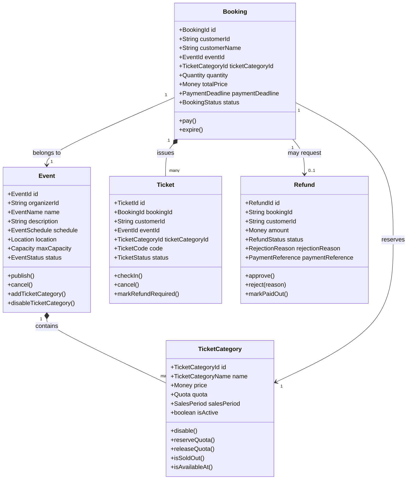

# Event Ticketing & Booking System

## How to Run the Project

### Prerequisites
- Node.js >= 18
- PostgreSQL >= 14

### 1. Install Dependencies
```bash
npm install
```

### 2. Configure PostgreSQL

Create a `.env` file in the project root with the following variables:
```env
DB_HOST=localhost
DB_PORT=5432
DB_USERNAME=postgres
DB_PASSWORD=postgres
DB_NAME=event_ticketing
```

Then create the database in PostgreSQL:
```sql
CREATE DATABASE event_ticketing;
```

### 3. Run Database Migration
```bash
npm run migrate
```

### 4. Start the Application
```bash
npm run start
```

The API will be available at `http://localhost:3000`.

### 5. Run Tests
```bash
npm test
```

## REST API Summary

### Event Endpoints

* `POST /events`
* `GET /events`
* `GET /events/<event_id>`
* `PATCH /events/<event_id>/publish`
* `PATCH /events/<event_id>/cancel`
* `POST /events/<event_id>/ticket-categories`
* `PATCH /events/<event_id>/ticket-categories/<category_id>/disable`
* `GET /events/<event_id>/sales-report`
* `GET /events/<event_id>/participants`

### Booking Endpoints

* `POST /bookings`
* `PATCH /bookings/<booking_id>/pay`
* `PATCH /bookings/<booking_id>/expire`
* `POST /bookings/expire-overdue`
* `GET /bookings/my-tickets`
* `GET /bookings/<booking_id>/tickets`

### Ticket Endpoints

* `POST /tickets/check-in`

### Refund Endpoints

* `POST /refunds`
* `PATCH /refunds/<refund_id>/approve`
* `PATCH /refunds/<refund_id>/reject`
* `PATCH /refunds/<refund_id>/paid-out`

### Example Create Event Request

```json
{
  "organizerId": "ORG-001",
  "name": "Tech Conference 2026",
  "description": "Annual technology conference",
  "startDate": "2026-08-10T09:00:00Z",
  "endDate": "2026-08-10T17:00:00Z",
  "address": "ITS Sukolilo",
  "city": "Surabaya",
  "maxCapacity": 500
}
```

### Example Create Ticket Category Request

```json
{
  "organizerId": "ORG-001",
  "name": "VIP",
  "price": 500000,
  "currency": "IDR",
  "quota": 100,
  "salesStartDate": "2026-07-01T00:00:00Z",
  "salesEndDate": "2026-08-10T00:00:00Z"
}
```

### Example Create Booking Request

```json
{
  "customerId": "CUS-001",
  "customerName": "Malika",
  "eventId": "EVT-001",
  "ticketCategoryId": "CAT-001",
  "quantity": 2
}
```

### Example Pay Booking Request

```json
{
  "customerId": "CUS-001",
  "paymentAmount": 1000000,
  "currency": "IDR"
}
```

### Example Refund Request

```json
{
  "customerId": "CUS-001",
  "bookingId": "BOOK-001"
}
```

### Example Ticket Check-In Request

```json
{
  "ticketCode": "VIP-001",
  "eventId": "EVT-001"
}
```

---

## Implemented User Stories

| # | User Story |
|---|---|
| US 1 | Create Event |
| US 2 | Publish Event |
| US 3 | Cancel Event |
| US 4 | Create Ticket Category |
| US 5 | Disable Ticket Category |
| US 6 | View Available Events |
| US 7 | View Event Details |
| US 8 | Create Ticket Booking |
| US 9 | Calculate Booking Total Price |
| US 10 | Pay Booking |
| US 11 | Expire Booking |
| US 12 | View Purchased Tickets |
| US 13 | Check In Ticket |
| US 14 | Reject Invalid Ticket Check-in |
| US 15 | Request Refund |
| US 16 | Approve Refund |
| US 17 | Reject Refund |
| US 18 | Mark Refund as Paid Out |
| US 19 | View Event Sales Report |
| US 20 | View Event Participants |

## Implemented Domain Events

| Domain Event | Raised When |
|---|---|
| `EventCreated` | A new event is successfully created |
| `EventPublished` | An event transitions from Draft to Published |
| `EventCancelled` | A Published event is cancelled |
| `TicketCategoryCreated` | A ticket category is added to an event |
| `TicketCategoryDisabled` | A ticket category is deactivated |
| `TicketReserved` | A booking is created (quota reserved) |
| `BookingPaid` | A booking payment is confirmed |
| `BookingExpired` | A booking passes its payment deadline unpaid |
| `TicketCheckedIn` | A ticket is scanned and validated at entry |
| `RefundRequested` | A customer submits a refund request |
| `RefundApproved` | An organizer approves a refund request |
| `RefundRejected` | An organizer rejects a refund request |
| `RefundPaidOut` | Admin marks a refund as disbursed |

## Implemented Application Service Interfaces

| Interface | Purpose |
|---|---|
| `IPaymentGateway` | Process booking payments via external payment gateway |
| `IRefundPaymentService` | Disburse refunds via bank/external refund service |
| `INotificationService` | Send email or WhatsApp notifications to customers |

---

```
event-ticketing/
├── src/
│   ├── domain/                              
│   │   ├── event/                           
│   │   │   ├── aggregates/
│   │   │   │   └── event.aggregate.ts       
│   │   │   ├── entities/
│   │   │   │   └── ticket-category.entity.ts
│   │   │   ├── value-objects/
│   │   │   │   ├── capacity.vo.ts           
│   │   │   │   ├── event-id.vo.ts           
│   │   │   │   ├── event-name.vo.ts         
│   │   │   │   ├── event-schedule.vo.ts     
│   │   │   │   ├── event-status.vo.ts       
│   │   │   │   ├── location.vo.ts           
│   │   │   │   ├── quota.vo.ts              
│   │   │   │   ├── sales-period.vo.ts       
│   │   │   │   ├── ticket-category-id.vo.ts
│   │   │   │   └── ticket-category-name.vo.ts
│   │   │   ├── domain-events/
│   │   │   │   ├── event-created.domain-event.ts
│   │   │   │   ├── event-published.domain-event.ts
│   │   │   │   ├── event-cancelled.domain-event.ts      
│   │   │   │   ├── ticket-category-created.domain-event.ts
│   │   │   │   └── ticket-category-disabled.domain-event.ts
│   │   │   └── repositories/
│   │   │       └── event.repository.interface.ts        
│   │   │
│   │   ├── booking/                        
│   │   │   ├── aggregates/
│   │   │   │   └── booking.aggregate.ts     
│   │   │   ├── value-objects/
│   │   │   │   ├── booking-id.vo.ts        
│   │   │   │   ├── booking-status.vo.ts     
│   │   │   │   ├── payment-deadline.vo.ts   
│   │   │   │   └── quantity.vo.ts          
│   │   │   ├── services/
│   │   │   │   └── booking-pricing.domain-service.ts
│   │   │   └── repositories/
│   │   │       └── booking.repository.interface.ts  
│   │   │
│   │   ├── ticket/                         
│   │   │   ├── aggregates/
│   │   │   │   └── ticket.aggregate.ts      
│   │   │   ├── value-objects/
│   │   │   │   ├── ticket-id.vo.ts          
│   │   │   │   ├── ticket-code.vo.ts        
│   │   │   │   └── ticket-status.vo.ts      
│   │   │   ├── services/
│   │   │   │   └── ticket-code-generator.domain-service.ts  
│   │   │   ├── domain-events/
│   │   │   │   └── ticket-checked-in.domain-event.ts  
│   │   │   └── repositories/
│   │   │       └── ticket.repository.interface.ts    
│   │   │
│   │   ├── refund/                          
│   │   │   ├── aggregates/
│   │   │   │   └── refund.aggregate.ts      
│   │   │   ├── value-objects/
│   │   │   │   ├── refund-id.vo.ts          
│   │   │   │   ├── refund-status.vo.ts      
│   │   │   │   ├── rejection-reason.vo.ts   
│   │   │   │   └── payment-reference.vo.ts  
│   │   │   ├── services/
│   │   │   │   └── refund-eligibility.domain-service.ts  
│   │   │   ├── domain-events/
│   │   │   │   ├── refund-requested.domain-event.ts   
│   │   │   │   ├── refund-approved.domain-event.ts   
│   │   │   │   ├── refund-rejected.domain-event.ts   
│   │   │   │   └── refund-paid-out.domain-event.ts    
│   │   │   └── repositories/
│   │   │       └── refund.repository.interface.ts     
│   │   │
│   │   └── shared/                          
│   │       └── value-objects/
│   │           ├── money.vo.ts              
│   │           ├── customer-id.vo.ts        
│   │           └── organizer-id.vo.ts       
│   │
│   ├── application/                         
│   ├── infrastructure/                     
│   └── presentation/                        
│
├── test/
│   └── domain/
│       ├── event/
│       │   ├── event.aggregate.spec.ts       
│       │   ├── event-schedule.vo.spec.ts    
│       │   └── ticket-category.entity.spec.ts  
│       ├── booking/
│       │   ├── booking.aggregate.spec.ts     
│       │   └── quantity.vo.spec.ts          
│       ├── refund/
│       │   ├── refund.aggregate.spec.ts      
│       │   └── refund-eligibility.domain-service.spec.ts  
│       └── ticket/
│           └── ticket.aggregate.spec.ts     
│
├── jest.config.js
├── tsconfig.json
├── package.json
└── README.md
```

---

## Domain Model
## 3. Initial Domain Model Draft



### Aggregates & Entities

| Aggregate Root | Child Entities |  
|---|---| 
| `Event` | `TicketCategory` | 
| `Booking` | `Ticket` (via reference) |  
| `Refund` | — |  
| `Ticket` | — |  

### Aggregate Relationships

```
Event (Aggregate Root)
└── TicketCategory (Entity, owned by Event)

Booking (Aggregate Root)
└── references → Event, TicketCategory, Customer
└── produces  → Ticket (after payment)

Refund (Aggregate Root)
└── references → Booking, Ticket
```

---

## Value Objects

### Shared Value Objects

| Value Object | Attributes | Invariants |
|---|---|---|
| `Money` | `amount`, `currency` | `amount >= 0`; currency mismatch throws on arithmetic |

### Event Value Objects

| Value Object | Attributes | Invariants |
|---|---|---|
| `EventId` | `value: UUID` | Auto-generated if not provided |
| `EventName` | `value: string` | Non-empty, max 255 characters |
| `EventSchedule` | `startDate`, `endDate` | `endDate >= startDate` |
| `EventStatus` | `value: enum` | Draft → Published → Completed; Draft → Cancelled |
| `Location` | `address`, `city` | Both fields non-empty |
| `Capacity` | `value: number` | Positive integer > 0 |
| `Quota` | `total`, `remaining` | `total > 0`, `0 <= remaining <= total` |
| `SalesPeriod` | `startDate`, `endDate` | `endDate >= startDate` AND `endDate <= eventStartDate` |
| `TicketCategoryId` | `value: UUID` | Auto-generated if not provided |
| `TicketCategoryName` | `value: string` | Non-empty, max 100 characters |

### Booking Value Objects  

| Value Object | Attributes | Invariants |
|---|---|---|
| `BookingId` | `value: UUID` | Auto-generated |
| `BookingStatus` | `value: enum` | PendingPayment → Paid → Refunded; PendingPayment → Expired |
| `PaymentDeadline` | `value: Date` | Must be 15 min after booking creation |
| `Quantity` | `value: number` | Must be > 0 |

### Ticket Value Objects 

| Value Object | Attributes | Invariants |
|---|---|---|
| `TicketId` | `value: UUID` | Auto-generated |
| `TicketCode` | `value: string` | Unique, generated after payment |
| `TicketStatus` | `value: enum` | Active → CheckedIn; Active → Cancelled; Active → RefundRequired |

### Refund Value Objects  

| Value Object | Attributes | Invariants |
|---|---|---|
| `RefundId` | `value: UUID` | Auto-generated |
| `RefundStatus` | `value: enum` | Requested → Approved → PaidOut; Requested → Rejected |
| `RejectionReason` | `value: string` | Non-empty when rejecting |
| `PaymentReference` | `value: string` | Recorded when paid out |

---

## Implemented User Stories

| # | User Story |  
|---|---| 
| US 1 | Create Event |  
| US 2 | Publish Event |  
| US 3 | Cancel Event |  
| US 4 | Create Ticket Category |  
| US 5 | Disable Ticket Category |  
| US 6 | View Available Events |  
| US 7 | View Event Details |  
| US 8 | Create Ticket Booking | 
| US 9 | Calculate Booking Total Price | 
| US 10 | Pay Booking |  
| US 11 | Expire Booking |  
| US 12 | View Purchased Tickets |  
| US 13 | Check In Ticket |  
| US 14 | Reject Invalid Ticket Check-in |  
| US 15 | Request Refund |  
| US 16 | Approve Refund |  
| US 17 | Reject Refund |  
| US 18 | Mark Refund as Paid Out |  
| US 19 | View Event Sales Report |  
| US 20 | View Event Participants |  

---

## Implemented Domain Events

| Domain Event | Raised When |  
|---|---|
| `EventCreated` | A new event is successfully created |  
| `EventPublished` | An event transitions from Draft to Published | 
| `EventCancelled` | A Published event is cancelled |  
| `TicketCategoryCreated` | A ticket category is added to an event |  
| `TicketCategoryDisabled` | A ticket category is deactivated |  
| `TicketReserved` | A booking is created (quota reserved) | 
| `BookingPaid` | A booking payment is confirmed |  
| `BookingExpired` | A booking passes its payment deadline unpaid |  
| `TicketCheckedIn` | A ticket is scanned and validated at entry |  
| `RefundRequested` | A customer submits a refund request | 
| `RefundApproved` | An organizer approves a refund request |  
| `RefundRejected` | An organizer rejects a refund request |  
| `RefundPaidOut` | Admin marks a refund as disbursed |  

---

## Implemented Application Service Interfaces

| Interface | Purpose |
|---|---|
| `IPaymentGateway` | Process booking payments via external payment gateway |
| `IRefundPaymentService` | Disburse refunds via bank/external refund service |
| `INotificationService` | Send email or WhatsApp notifications to customers |

---

## Business Rules

### Event

- An event cannot be created if `endDate` is earlier than `startDate`.
- An event cannot be created if `maxCapacity` is zero or negative.
- A newly created event always has status **Draft**.
- An event can only be published if it has **at least one active** ticket category.
- An event can only be published if the total quota of active categories does **not exceed** `maxCapacity`.
- An event with status **Cancelled** cannot be published.
- An event with status **Completed** cannot be cancelled.
- When an event is cancelled, all paid bookings must be marked as requiring a refund.

### Ticket Category

- Ticket price cannot be negative (enforced by `Money` value object).
- Ticket quota must be greater than zero (enforced by `Quota` value object).
- The `salesEndDate` of a ticket category must be **≤ event startDate**.
- The cumulative quota of all active categories must not exceed the event's `maxCapacity`.
- A disabled ticket category is preserved for historical purposes but cannot accept new bookings.

### Booking

- A booking can only be created for an event with status **Published**.
- A booking can only be created for an **active** ticket category within its sales period.
- Ticket quantity must be greater than zero and must not exceed the remaining quota.
- A customer cannot have more than **one active booking** for the same event.
- A newly created booking has status **PendingPayment** with a deadline of 15 minutes.
- A booking can only be paid if it is **PendingPayment** and the deadline has not passed.
- Payment amount must exactly equal the total booking price.
- A **Paid** booking cannot be expired.
- When a booking expires, its reserved quota is released.

### Refund

- A refund can only be requested for a **Paid** booking.
- A refund cannot be requested if any ticket has already been **CheckedIn**.
- A refund can only be approved or rejected when in **Requested** status.
- A rejection must include a reason.
- When approved: related tickets → **Cancelled**, booking → **Refunded**.
- A refund can only be marked **PaidOut** if it is **Approved**.
- A PaidOut refund is terminal — no further state transitions allowed.

---

## Ubiquitous Language Glossary

| Term | Meaning |
|---|---|
| **Event** | An activity organized by an Event Organizer and attended by Customers. |
| **Event Organizer** | A user who creates, manages, and publishes events. |
| **Customer** | A user who browses events, creates bookings, and purchases tickets. |
| **Gate Officer** | A user who validates tickets during event check-in. |
| **System Admin** | A user who manages refund payouts and monitors system operations. |
| **Ticket Category** | A type of ticket for an event, such as Regular, VIP, or Early Bird. |
| **Quota** | The maximum number of tickets available in a ticket category. |
| **Remaining Quota** | The number of tickets still available for purchase. |
| **Booking** | A temporary reservation created before payment is completed. |
| **PendingPayment** | Booking status: payment has not yet been completed. |
| **Paid** | Booking status: payment has been successfully processed. |
| **Expired** | Booking status: payment deadline passed without payment. |
| **Refunded** | Booking status: a refund has been approved for this booking. |
| **Ticket** | Proof of attendance generated after a booking is paid. |
| **Ticket Code** | A unique code used to identify and validate a ticket at check-in. |
| **Check-in** | The process of validating a ticket when a participant enters the event venue. |
| **Refund** | The process of returning money to a customer. |
| **Money** | A value object representing a monetary amount with amount and currency. |
| **Sales Period** | The time window during which a ticket category can be purchased. |
| **Payment Deadline** | The deadline by which a booking must be paid before it expires (15 minutes). |
| **Draft** | Event status: created but not yet published. |
| **Published** | Event status: visible to customers and open for ticket purchase. |
| **Cancelled** | Event status: event will not take place; all sales are stopped. |
| **Completed** | Event status: event has concluded. |
| **Active** | Ticket status: valid and not yet used for check-in. |
| **CheckedIn** | Ticket status: ticket holder has entered the event. |
| **Requested** | Refund status: submitted and awaiting review. |
| **Approved** | Refund status: accepted by the organizer. |
| **Rejected** | Refund status: denied by the organizer. |
| **PaidOut** | Refund status: money has been disbursed to the customer. |
| **Domain Event** | A record of something significant that happened in the domain. |
| **Aggregate** | A cluster of domain objects treated as a single unit for data changes. |
| **Value Object** | An immutable object identified by its attributes, not by an ID. |
| **Repository** | An abstraction for storing and retrieving aggregates. |
